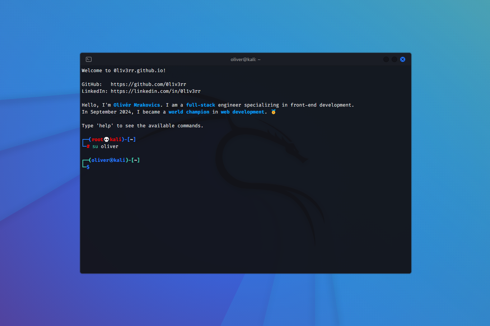

<h1><a href="https://github.com/Lunixizm/Project-001" target="_blank">Terminal Portfolio Website</a></h1>



<hr>

## Features

- Kali Linux-like interface
- Fun commands
- Tab autocomplete
- Hotkeys
- Interactive UI

<hr>

[](https://github.com/0l1v3rr/github-readme-tech-stack)

<hr>

## Building from source

```sh
# 1. Clone the repo
git clone https://github.com/Lunixizm/TerminalPortfolio
cd TerminalPortfolio

# 2. Install the necessary dependencies
npm install

# 3. Run the app
npm start
```
